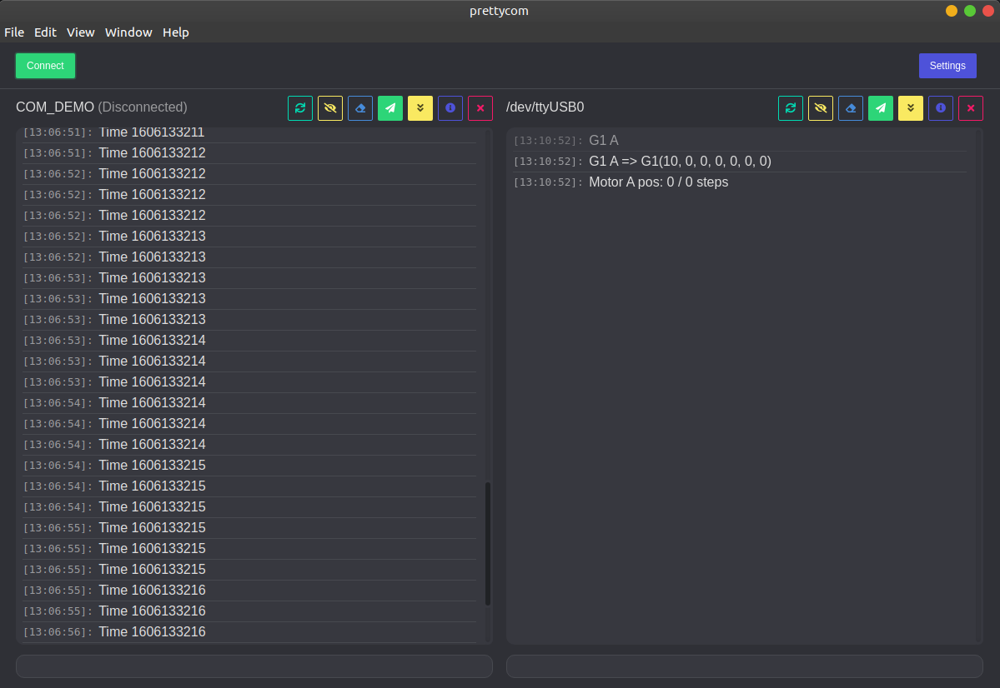

# Prettycom 
----
Inspired by [CuteCom](https://gitlab.com/cutecom/cutecom/), Prettycom is a cross-platform serial monitor written in electron.

## Installation
Binaries can be found [here](https://github.com/hyldmo/prettycom/releases).

## Development
- Clone repository: `git clone https://github.com/hyldmo/prettycom.git`
- Run `yarn`
- Run `yarn dev`, or if you're using VSCode, press `F5`

### Notes
- Code in `app/server` server folder lives inside electron, and is not automatically reloaded.
You will have to restart the electron shell for changes to be reflected.
- Build files (such as `.js` and `.css`) are automatically hidden in VS Code. Go to `.vscode\settings.json` to unhide them.
- If you are switching branches and you're getting errors, try running `yarn clean` to clear old build files
